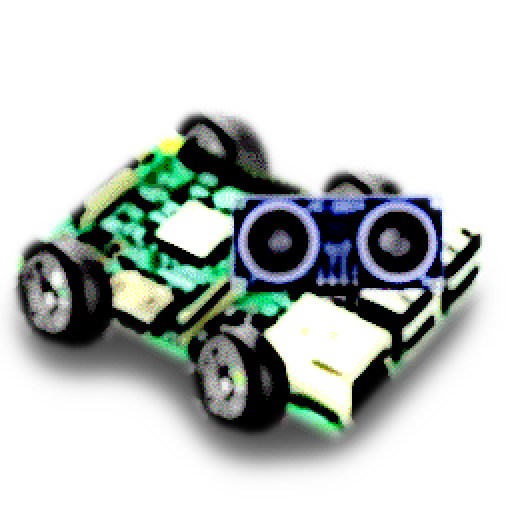

# PiRobot

A general purpose robotics framework for the Raspberry Pi written in Python




## TESTING ON WINDOWS

The RPi package does not exist so when testing on windows create a file `./Robot/Rpi/GPIO.py` and place this in the file:

```Python
BOARD = 1
OUT = 1
IN = 1


class PWM:
    def __init__(self, p, f):
        pass

    def ChangeDutyCycle(self, d):
        pass


def setmode(a):
    pass


def setup(a, b):
    pass


def output(a, b):
    pass


def cleanup():
    pass


def setwarnings(flag):
    pass

```
